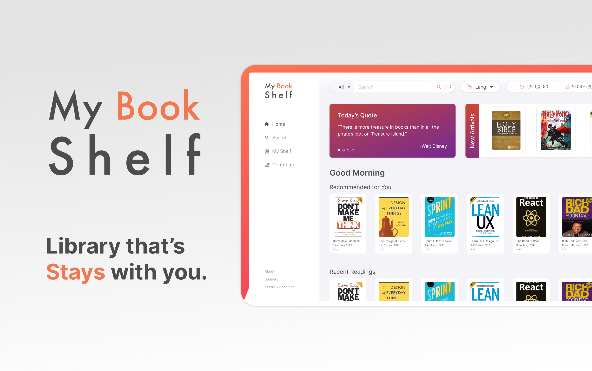

# 📚 My Book Shelf

This project is a personal book management system to keep track of your reading list and favorite books. It allows you to add, edit, and remove books from your collection. You can also categorize books by genre, author, and status (e.g., read, currently reading, want to read).

## Features:
- ➕ Add new books with details such as title, author, genre, and status.
- ✏️ Edit existing book information.
- ❌ Remove books from your collection.
- 🏷️ Categorize books by genre and author.
- 📖 Track reading status (read, currently reading, want to read).
- 🔍 Search and filter books in your collection.

// ...existing code...

// ...existing code...
